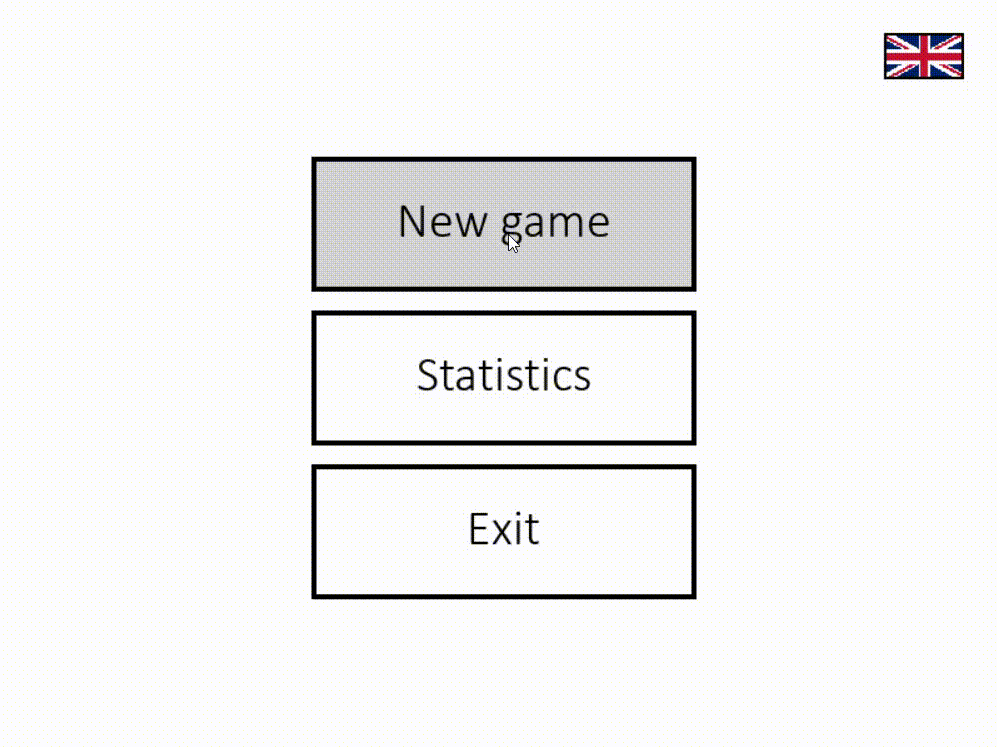
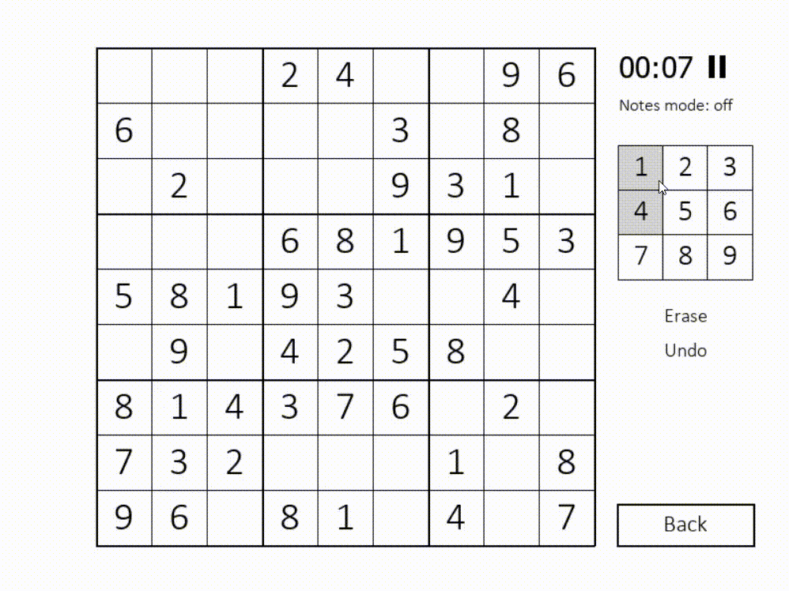
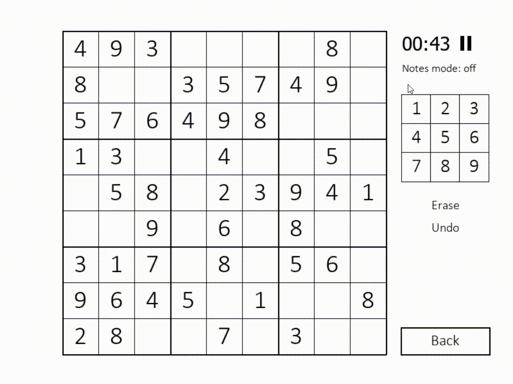
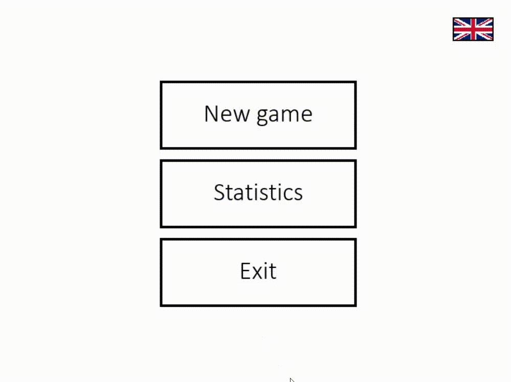
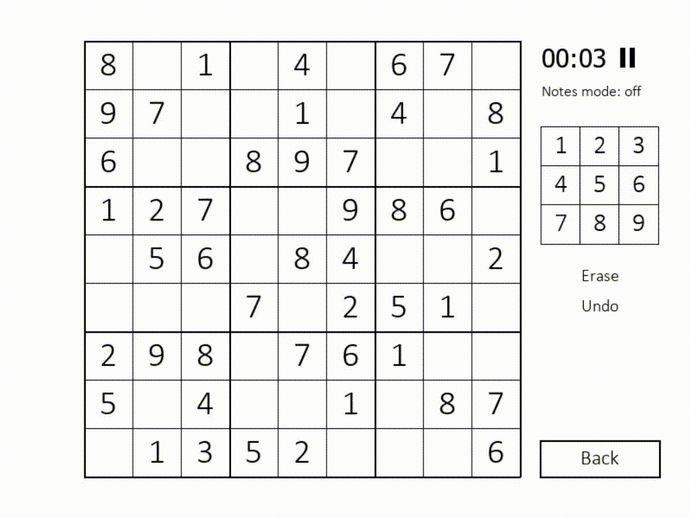
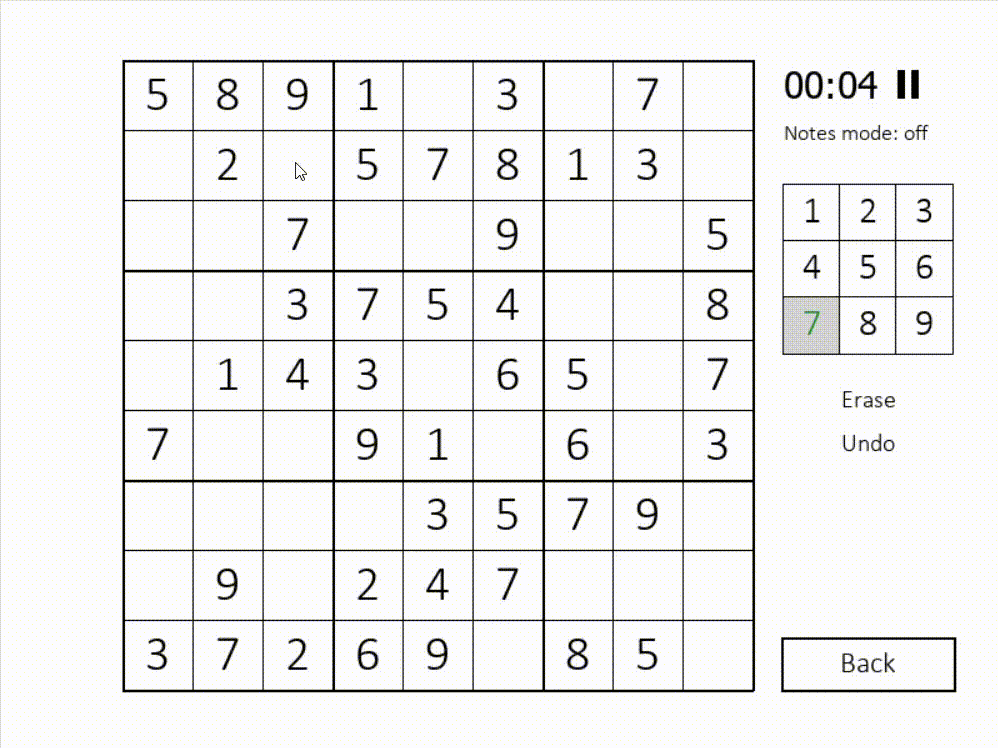

# sudoku-game
The simple sudoku game based on pygame. Built on Python 3.8.

# Launching game
The only external library needed to run is pygame. Run the sudoku_gui.py and enjoy!

# Features
- Four difficulty levels  
  
  
- Four languages  
  

- Pausing/Unpausing  
  

- Notes mode  
  

- Saving and resetting game statistics (best time, average time and games count on every difficulty)  
  

- Continuation after returning to the menu  
  

- Reverting the last move  
  

# Keyboard controls
Although the game can be controlled with mouse, there is also the keyboard input handler:
- Numeric keys - inputting numbers into the selected square
- Arrow keys - move the selected square
- Tab - notes mode on/off
- Delete/Backspace - clear the selected square 

